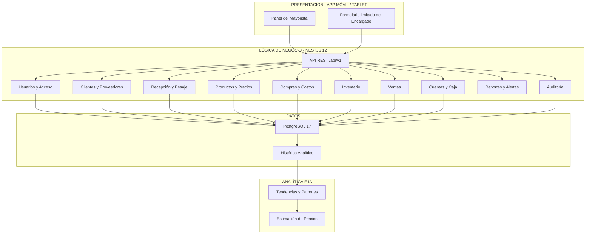

# Arquitectura Inicial del Sistema

## Aplicación móvil de gestión comercial de mayoristas de papa

La arquitectura inicial de la solución se organiza en capas de **Presentación**, **Lógica de Negocio** y **Datos**, incorporando además componentes de **Analítica e Inteligencia Artificial** y elementos transversales de operación, seguridad y monitoreo.

El backend se implementará inicialmente como un **monolito modular con NestJS 12**, utilizando **TypeScript**, una **API REST versionada** y **PostgreSQL 17** como base de datos central.

La aplicación móvil/tablet no accederá directamente a la base de datos. Toda comunicación con la plataforma central se realizará mediante la API REST.

## 1. Capa de Presentación

La capa de presentación corresponde a la aplicación móvil utilizada por el mayorista y el encargado.

### Mayorista

El mayorista tendrá acceso completo a las funcionalidades autorizadas del sistema, entre ellas:

- Recepción y pesaje.
- Compras.
- Ventas.
- Inventario.
- Cuentas.
- Caja.
- Reportes.
- Tendencias y patrones.
- Pronósticos.
- Configuración.
- Administración de usuarios.

### Encargado

Cuando reemplace temporalmente al mayorista, el encargado tendrá acceso limitado a:

- Registro de pesaje saco por saco.
- Registro de compras.
- Registro de ventas.

No tendrá acceso a inventario, cuentas, caja, reportes, inteligencia artificial, configuración ni administración de usuarios.

## 2. Capa de Lógica de Negocio

La lógica de negocio estará implementada en el backend mediante **NestJS 12** y organizada en módulos funcionales.

Los principales módulos serán:

- Usuarios y acceso.
- Clientes y proveedores.
- Productos y precios.
- Recepción y pesaje.
- Compras y costos.
- Inventario.
- Ventas.
- Cuentas por pagar.
- Cuentas por cobrar.
- Caja.
- Alertas.
- Reportes.
- Auditoría.

Esta capa será responsable de validar las operaciones, aplicar las reglas del negocio y coordinar el acceso a los datos.

## 3. Capa de Datos

La capa de datos utilizará **PostgreSQL 17** como base de datos central.

La persistencia permitirá almacenar información relacionada con:

- Negocios.
- Usuarios.
- Proveedores.
- Compradores.
- Vehículos y conductores.
- Recepciones.
- Pesajes.
- Productos.
- Lotes.
- Compras.
- Ventas.
- Inventario.
- Pagos.
- Cobranzas.
- Saldos.
- Auditoría.

Las migraciones de la base de datos serán gestionadas mediante **TypeORM**.

La base de datos central será la fuente oficial de operaciones y saldos.

## 4. Analítica e Inteligencia Artificial

El componente analítico se mantendrá separado de las operaciones transaccionales principales.

Utilizará progresivamente el historial validado para:

- Analizar la evolución de precios.
- Identificar tendencias.
- Detectar patrones.
- Analizar variedad, calidad, procedencia y volumen.
- Generar estimaciones de precios cuando exista información histórica suficiente.
- Mostrar rango y nivel de confianza.
- Comparar las estimaciones con los valores reales.

La inteligencia artificial funcionará como apoyo para la toma de decisiones y no reemplazará el criterio del mayorista.

## 5. Operación y elementos transversales

La solución también contempla elementos transversales para garantizar el funcionamiento y evolución del sistema:

- Autenticación.
- Autorización por rol y negocio.
- Auditoría.
- Monitoreo.
- Registros de eventos.
- Copias de seguridad.
- Recuperación.
- Despliegue controlado.

## Diagrama de Arquitectura Inicial

## Responsabilidades por capa

| Capa | Componentes principales | Responsabilidad |
|---|---|---|
| Presentación | Panel del mayorista y formulario limitado del encargado | Permitir la interacción con el sistema según los permisos asignados a cada actor. |
| Lógica de negocio | NestJS 12, API REST y módulos funcionales | Ejecutar las reglas relacionadas con recepción, compras, costos, inventario, ventas, cuentas, alertas y auditoría. |
| Datos | PostgreSQL 17, TypeORM e histórico analítico | Mantener la integridad de las operaciones, almacenar la información comercial y conservar el historial. |
| Analítica e IA | Histórico validado, análisis de patrones y predicción | Identificar tendencias y patrones y generar estimaciones cuando existan datos suficientes. |
| Operación | Monitoreo, registros, respaldos y despliegue | Mantener disponibilidad, diagnóstico, recuperación y evolución controlada del sistema. |