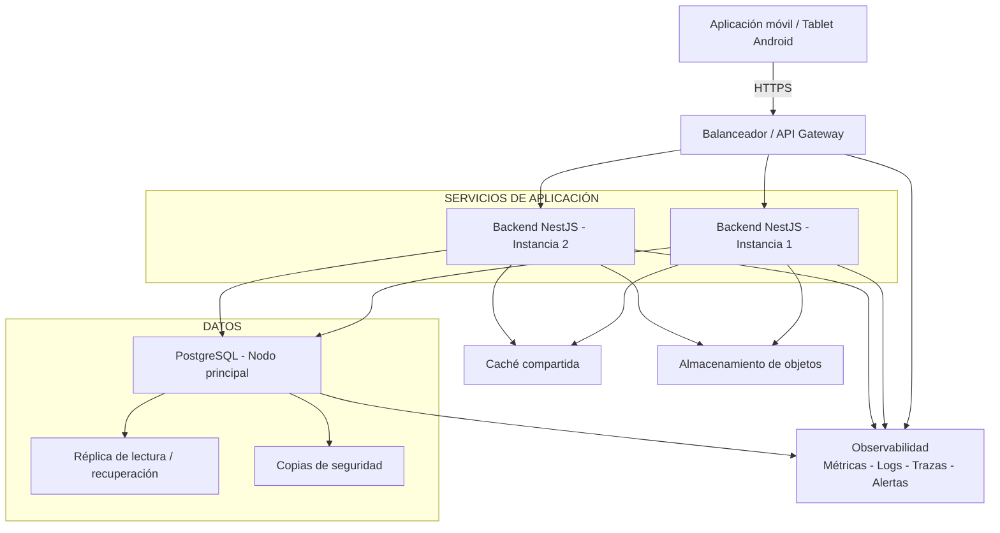

# Arquitectura de Despliegue

## Aplicación móvil de gestión comercial de mayoristas de papa

La arquitectura de despliegue se plantea de manera que la solución no dependa de un único servidor.

La aplicación móvil se comunicará con la plataforma central mediante Internet. Las solicitudes ingresarán por un **Balanceador o API Gateway**, que actuará como punto de entrada hacia las instancias del backend.

Las instancias del backend serán equivalentes y no conservarán sesiones ni información transaccional en memoria local. Esto permitirá reemplazar una instancia o agregar nuevas instancias cuando aumente la carga del sistema.

## Componentes del despliegue

| Componente | Decisión propuesta | Finalidad |
|---|---|---|
| Balanceador o API Gateway | Punto de entrada con TLS, autenticación, límites y comprobación de salud. | Distribuir el tráfico y retirar instancias que no se encuentren saludables. |
| Servicios de aplicación | Dos o más instancias equivalentes cuando el nivel de uso lo requiera. | Permitir escalamiento horizontal y reducir el riesgo de una falla única del servicio. |
| Caché compartida | Uso selectivo para catálogos y consultas frecuentes, con expiración e invalidación. | Reducir la latencia sin convertir la caché en la fuente oficial de la información. |
| Base de datos | PostgreSQL con nodo principal, réplica de lectura o recuperación y copias de seguridad verificadas. | Mantener la integridad, continuidad y capacidad de restauración de la información. |
| Archivos | Almacenamiento de objetos para comprobantes, exportaciones y respaldos documentales. | Separar los archivos del núcleo transaccional y facilitar su conservación. |
| Observabilidad | Métricas, registros, trazas, paneles y alertas centralizadas. | Detectar fallas, medir tiempos de respuesta y facilitar el diagnóstico del sistema. |

## Flujo de despliegue

El flujo principal de comunicación será el siguiente:

1. El usuario interactúa con la aplicación móvil/tablet.
2. La aplicación envía las solicitudes mediante HTTPS.
3. El Balanceador o API Gateway recibe las solicitudes.
4. El tráfico se distribuye hacia una de las instancias disponibles del backend.
5. El backend ejecuta las reglas de negocio.
6. Cuando corresponde, consulta la caché compartida.
7. Las operaciones transaccionales se almacenan en PostgreSQL.
8. Los archivos y documentos se almacenan de forma separada.
9. El sistema registra métricas, logs, trazas y alertas para facilitar el monitoreo.

## Escalamiento

El backend se diseñará sin estado, de manera que puedan agregarse nuevas instancias cuando aumente la carga.

Inicialmente, el sistema podrá operar con una infraestructura reducida. Cuando aumente la cantidad de usuarios o solicitudes, podrán añadirse nuevas instancias del backend detrás del balanceador.

La caché se utilizará únicamente para información que pueda reconstruirse, como catálogos o consultas frecuentes. Los saldos y las operaciones comerciales oficiales permanecerán almacenados en la base de datos central.

## Alta disponibilidad

Para mejorar la disponibilidad del sistema se consideran las siguientes medidas:

- Utilizar más de una instancia del backend cuando el nivel de uso lo requiera.
- Verificar periódicamente el estado de las instancias.
- Retirar automáticamente las instancias que presenten fallas.
- Mantener copias de seguridad verificadas de la base de datos.
- Contar con mecanismos de recuperación de PostgreSQL.
- Centralizar registros, métricas y alertas.
- Evitar almacenar información transaccional únicamente en memoria de las instancias.

## Base de datos y recuperación

PostgreSQL será la fuente oficial de operaciones y saldos.

La infraestructura podrá incorporar:

- Nodo principal de base de datos.
- Réplica de lectura o recuperación.
- Copias de seguridad verificadas.
- Procedimientos de restauración.

La réplica y la caché no reemplazarán las copias de seguridad.

## Observabilidad

La plataforma deberá disponer de mecanismos para conocer el estado del sistema mediante:

- Métricas.
- Registros de eventos.
- Trazas.
- Paneles de monitoreo.
- Alertas.

Estos elementos permitirán detectar fallas, observar tiempos de respuesta y apoyar el diagnóstico de problemas.

## Estrategia de infraestructura

Durante el piloto se podrá utilizar una plataforma administrada de contenedores o aplicaciones.

El uso de Kubernetes se considerará únicamente cuando el volumen de uso, los requisitos de disponibilidad y la capacidad operativa del proyecto justifiquen su complejidad.

La selección final de infraestructura deberá considerar:

- Costo.
- Soporte.
- Capacidad de recuperación.
- Experiencia del equipo.
- Requisitos de seguridad.
- Capacidad operativa.

## Diagrama de Despliegue

## Consideración final

La arquitectura de despliegue permitirá iniciar con una infraestructura sencilla y aumentar progresivamente su capacidad cuando el uso del sistema lo requiera. El escalamiento deberá realizarse de acuerdo con las necesidades reales del proyecto, evitando incorporar complejidad operativa antes de que sea necesaria.