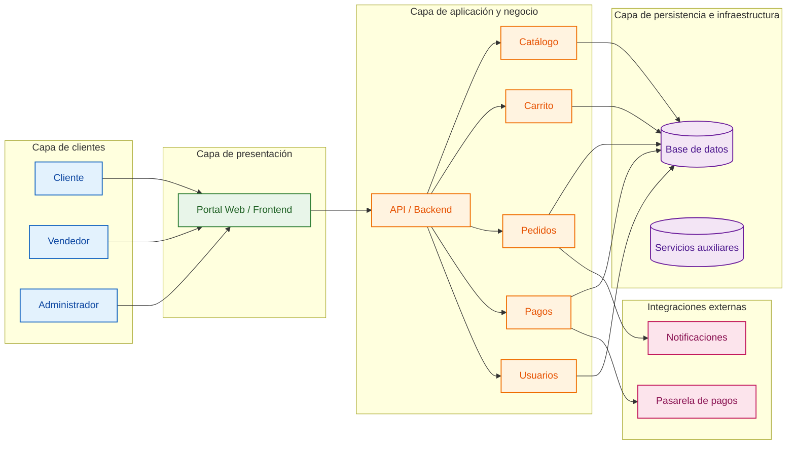

````md
# Estilo arquitectónico

Se seleccionó una arquitectura de tipo monolito modular, apoyada en principios de Clean Architecture, con el objetivo de mantener una sola aplicación desplegable, pero organizada en módulos funcionales claramente definidos. Esta decisión mejora la mantenibilidad, facilita la evolución del negocio y permite escalar de forma controlada sin romper la cohesión general del sistema.

## Resumen ejecutivo

- Un único sistema desplegable, pero modular por dominio.
- Separación clara entre reglas de negocio, casos de uso y tecnología.
- Módulos independientes para catálogo, ventas, pagos y usuarios.
- Bajo acoplamiento con proveedores externos mediante interfaces y adaptadores.
- Base sólida para crecimiento gradual sin migración completa de arquitectura.

## Diagrama de arquitectura



## Principales componentes

- Cliente: consulta productos, realiza compras y gestiona su orden.
- Vendedor: administra ventas, stock y catálogo.
- Administrador: supervisa operaciones, usuarios y configuración del sistema.
- Frontend: interfaz web para la interacción con los usuarios.
- API / Backend: coordina la lógica de negocio y la comunicación entre módulos.
- Módulos:
  - Catálogo
  - Carrito
  - Pedidos
  - Pagos
  - Usuarios
- Base de datos: persistencia central de información.
- Pasarela de pagos: servicio externo para procesamiento financiero.
- Notificaciones: integración para alertas y confirmaciones.

## Principios de diseño aplicados

- Monolito modular: una sola aplicación desplegable con dominios funcionales separados.
- Clean Architecture: independencia entre reglas de negocio y detalles técnicos.
- Bajo acoplamiento: cada módulo interactúa mediante contratos definidos.
- Escalabilidad controlada: posibilidad de crecer por funcionalidad sin afectar la base del sistema.
- Mantenibilidad: cambios del negocio o tecnología se gestionan de forma más segura.

Este estilo arquitectónico ofrece un equilibrio adecuado entre simplicidad operativa y capacidad de evolución, siendo una opción sólida para un sistema comercial de mayoristas con crecimiento progresivo.
````