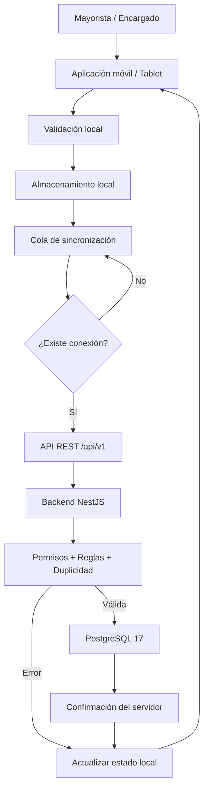

# Flujo de Sincronización

## Aplicación móvil de gestión comercial de mayoristas de papa

La aplicación móvil debe continuar operando temporalmente cuando no exista conexión a Internet.

Para lograrlo, las operaciones autorizadas se almacenarán de manera local en la tablet y posteriormente se sincronizarán con la plataforma central cuando la conectividad sea restablecida.

Este mecanismo busca mantener la continuidad de las operaciones, evitar pérdida de información y prevenir registros duplicados.

## Objetivo de la sincronización

El proceso de sincronización debe permitir que operaciones como:

- Pesaje.
- Compras.
- Ventas.
- Registro de proveedores.
- Registro de compradores.
- Actualización de datos autorizados.

puedan registrarse temporalmente sin conexión y enviarse posteriormente al servidor.

## Flujo general

El proceso de sincronización se realizará de la siguiente manera:

1. El usuario registra una operación en la aplicación móvil.
2. La aplicación valida los campos requeridos.
3. La operación recibe un identificador único.
4. La información se guarda en el almacenamiento local de la tablet.
5. La operación queda marcada como pendiente de sincronización.
6. Cuando existe conexión a Internet, la aplicación intenta enviar la operación al backend.
7. El backend verifica:
   - autenticación;
   - permisos del usuario;
   - pertenencia al negocio;
   - reglas de negocio;
   - duplicidad de la operación.
8. Si la operación es válida, el backend la registra en la base de datos central.
9. El servidor devuelve una confirmación.
10. La aplicación actualiza el estado local de la operación como sincronizada.
11. La aplicación puede descargar los cambios autorizados desde el servidor.

## Estados de sincronización

Cada operación almacenada localmente podrá tener uno de los siguientes estados:

| Estado | Descripción |
|---|---|
| Pendiente | La operación fue registrada localmente y todavía no fue enviada al servidor. |
| Enviando | La aplicación se encuentra intentando transmitir la operación al backend. |
| Sincronizada | El servidor confirmó correctamente la operación. |
| Error | La operación no pudo sincronizarse y requiere un nuevo intento o revisión. |

## Identificador único

Cada operación creada en la tablet debe contar con un identificador único.

Este identificador permitirá reconocer la misma operación durante los reintentos de sincronización y evitar que un mismo registro sea procesado más de una vez.

## Idempotencia

El backend debe garantizar que el reenvío de una misma operación no genere duplicados.

Por ejemplo, si una compra fue enviada varias veces debido a problemas de conexión, el sistema debe registrar una sola compra y aplicar una sola vez sus efectos sobre:

- Inventario.
- Saldos.
- Pagos.
- Cuentas.
- Movimientos relacionados.

## Cola de sincronización

Las operaciones pendientes se organizarán en una cola local.

La cola permitirá:

- Conservar operaciones realizadas sin conexión.
- Reintentar automáticamente los envíos.
- Mantener el orden de las operaciones cuando sea necesario.
- Identificar operaciones con error.
- Evitar pérdida de información durante interrupciones de Internet.

## Reintentos

Cuando una operación no pueda sincronizarse debido a problemas de conectividad, permanecerá almacenada localmente.

La aplicación podrá realizar nuevos intentos cuando detecte nuevamente acceso a Internet.

Un reintento no debe generar una nueva operación en el servidor si la operación original ya fue confirmada.

## Conflictos

Cuando exista una diferencia entre la información local y la información central, el sistema deberá aplicar reglas definidas según el tipo de operación.

Las operaciones críticas, como:

- Inventario.
- Saldos.
- Compras.
- Ventas.
- Pagos.

deben respetar la base de datos central como fuente oficial.

## Seguridad

La sincronización debe realizarse mediante conexiones seguras.

El backend deberá verificar:

- Identidad del usuario.
- Rol.
- Negocio al que pertenece.
- Permisos sobre la operación.
- Integridad de la información recibida.

El almacenamiento local deberá proteger la información sensible mientras permanezca en la tablet.

## Auditoría

Las operaciones sincronizadas deberán conservar información que permita conocer:

- Usuario que realizó la operación.
- Fecha y hora.
- Dispositivo.
- Fecha de creación local.
- Fecha de sincronización.
- Cambios o correcciones realizadas.
- Estado final de la operación.

## Diagrama del Flujo de Sincronización

## Principio de funcionamiento

La aplicación debe seguir el principio **offline-first** para las operaciones autorizadas.

Esto significa que la conectividad a Internet no será un requisito permanente para registrar operaciones críticas durante el trabajo diario.

La plataforma central continuará siendo la fuente oficial de la información, mientras que el almacenamiento local permitirá mantener la continuidad operativa durante interrupciones temporales de conectividad.