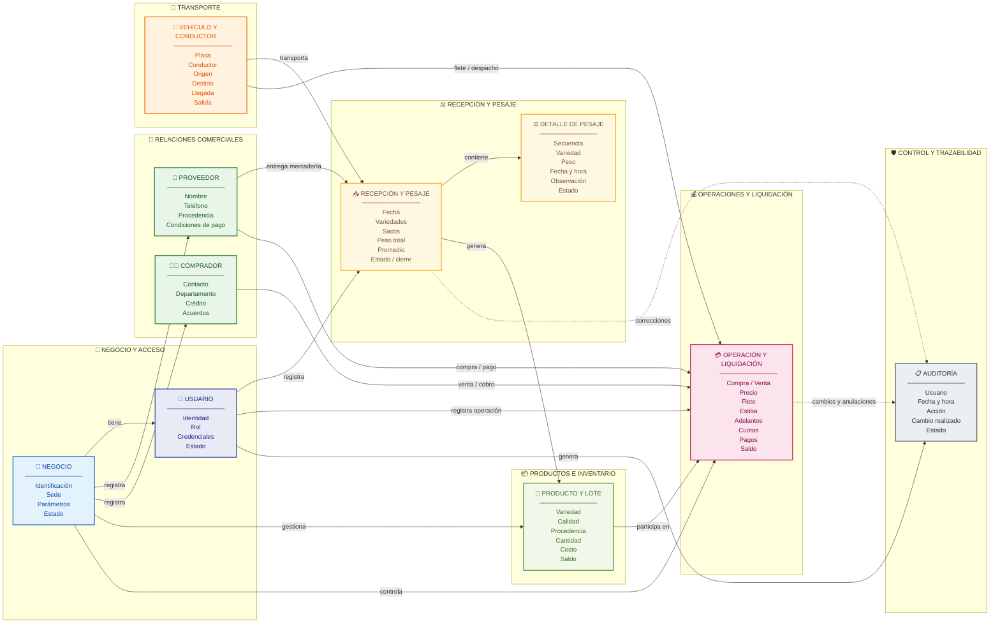

# Modelo de Información del Sistema

## Aplicación móvil de gestión comercial de mayoristas de papa

El siguiente modelo representa las principales entidades de información que participan en la gestión comercial del mayorista y las relaciones existentes entre ellas.

El modelo contempla información del negocio, usuarios, proveedores, compradores, vehículos, recepción y pesaje, productos y lotes, operaciones comerciales y auditoría.

## Diagrama del Modelo de Información

## Descripción del modelo

El **Negocio** constituye el contexto principal de la información y permite asociar usuarios, proveedores, compradores, productos y operaciones comerciales.

El **Usuario** representa al mayorista o encargado que interactúa con la aplicación. Cada usuario dispone de un rol y permisos definidos, y sus acciones pueden ser registradas mediante mecanismos de auditoría.

El **Proveedor** participa principalmente en el proceso de recepción y compra de mercadería, mientras que el **Comprador** participa en las operaciones de venta, despacho, cobro y crédito.

La entidad **Vehículo y conductor** permite mantener información relacionada con el traslado de mercadería, tanto durante el ingreso de productos como durante los despachos.

La **Recepción y pesaje** representa el ingreso de mercadería al negocio. Una recepción contiene múltiples registros de **Detalle de pesaje**, donde se conserva individualmente el peso de cada saco.

Al finalizar la recepción, la información permite generar los **Productos y lotes** correspondientes, que posteriormente forman parte del inventario disponible.

La entidad **Operación y liquidación** representa las compras y ventas realizadas por el negocio y concentra información relacionada con precio, flete, estiba, adelantos, cuotas, pagos y saldos.

Finalmente, la **Auditoría** permite mantener trazabilidad sobre operaciones, modificaciones, correcciones y anulaciones realizadas por los usuarios.

## Flujo principal de información

El flujo general del modelo puede resumirse de la siguiente manera:

**Proveedor → Recepción → Detalle de pesaje → Producto/Lote → Operación comercial**

Para una compra:

**Proveedor → Recepción → Pesaje → Lote → Compra → Pago o saldo pendiente**

Para una venta:

**Producto/Lote → Venta → Comprador → Cobro o saldo pendiente**

Todas las operaciones relevantes quedan asociadas al usuario responsable y pueden generar registros de auditoría.